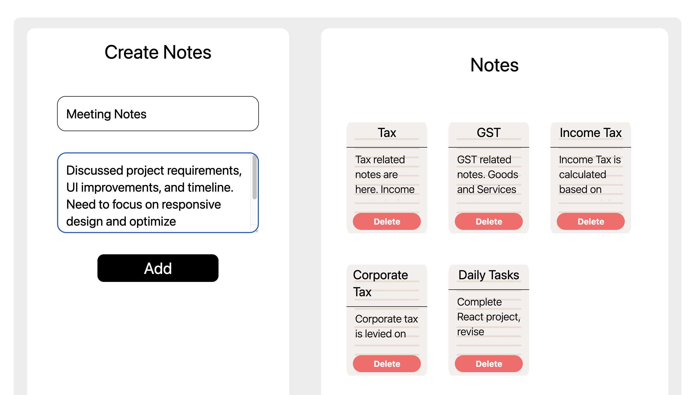

# Notes App (React)

A clean and responsive Notes App built using React. This project demonstrates form handling, state management, dynamic rendering, and data persistence using localStorage.

---

## Features

* Add new notes with title and content
* Delete notes dynamically
* Persistent storage using **localStorage**
* Responsive UI using **Tailwind CSS**
* Clean component-based architecture

---

## Concepts Used

* React Components
* Props (data passing)
* useState Hook
* useEffect Hook
* Form Handling
* LocalStorage
* Array methods (`map`, `filter`)
* JSX

---

## Project Structure

```bash
src/
 ├── components/
 │    ├── Notes_project.jsx        # Main logic & state management
 │    ├── NoteForm.jsx             # Form to add notes
 │    ├── NotesList.jsx            # Displays all notes
 │    ├── NotesBox.jsx             # Individual note card
 │    ├── NotesBox.module.css      # Component-specific styles (scrollbar)
 │
 ├── data/
 │    ├── notesData.js             # Initial notes data
 │
 ├── App.jsx                       # Root component
 ├── App.css                       # Global app-level styles
 ├── index.css                     # Tailwind CSS import
 ├── main.jsx                      # Entry point
```

---

## Preview


---

## Tech Stack

* React (Vite)
* JavaScript (ES6)
* Tailwind CSS
* HTML (JSX)
* CSS Modules

---

## How It Works

* Notes are stored in React state
* New notes are added via form input
* Notes are deleted using unique IDs
* Data is saved in **localStorage** for persistence
* UI updates dynamically using React rendering

---

## Installation & Setup

```bash
git clone https://github.com/hrjoshi1302/notes-app-react.git
cd notes-app-react
npm install
npm run dev
```

---

## Author

**Himal Joshi**
